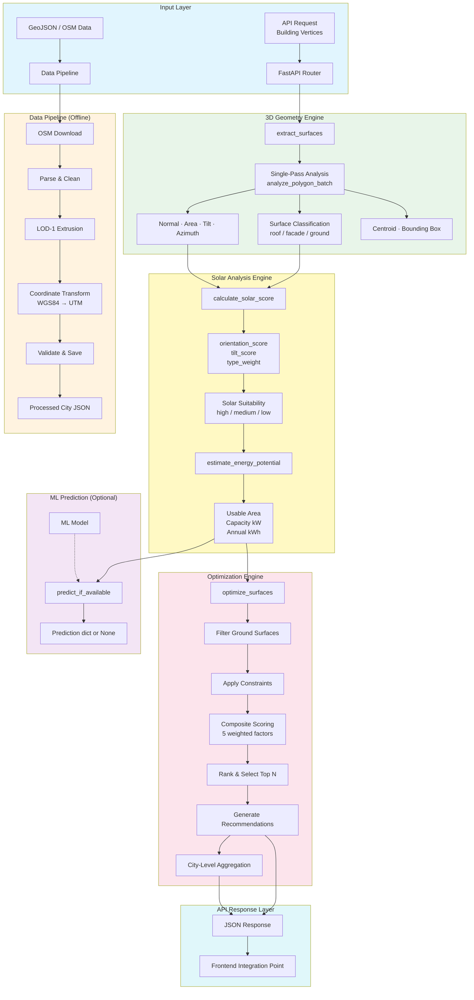

# SolarIQ Architecture

## System Overview

SolarIQ is a backend API for assessing Building-Integrated Photovoltaic (BIPV)
solar potential. It takes 3D building geometry as input and produces solar
suitability scores, energy estimates, and ranked optimization results.

## Component Map

| Component | Location | Purpose |
|-----------|----------|---------|
| FastAPI Application | `backend/main.py` | HTTP server, middleware, error handling |
| API Routers | `backend/api/` | Endpoint handlers for each domain |
| Geometry Engine | `backend/geometry/` | 3D polygon analysis, normals, area, classification |
| Solar Engine | `backend/services/solar_service.py` | Solar scoring, energy estimation |
| ML Service | `backend/services/ml_service.py` | ML model adapter (Protocol pattern) |
| Optimization | `backend/services/optimization_service.py` | Multi-factor ranking, city aggregation |
| Analysis Service | `backend/services/analysis_service.py` | Orchestrates geometry → solar → ML pipeline |
| Data Pipeline | `data_pipeline/` | Offline data ingestion (OSM, weather, solar) |
| Configuration | `backend/config.py` | All tunable parameters via env vars |
| Database Layer | `backend/db/` | SQLAlchemy ORM models and repositories |

## Data Flow

### Real-Time API Flow (per request)

1. Client sends building geometry (vertices as `[x, y, z]` triples)
2. FastAPI validates via Pydantic schemas
3. `extract_surfaces()` converts vertices → geometric properties in a single pass
4. `analyze_surface()` computes solar score and energy potential
5. `predict_if_available()` optionally runs ML model (currently returns `None`)
6. Response returned as structured JSON

### Offline Data Pipeline Flow

1. Download building footprints from OpenStreetMap (Overpass API)
2. Parse raw OSM elements into building dicts
3. Clean: remove duplicates, invalid geometries, normalize IDs
4. Extrude LOD-1 box geometry from footprints + height
5. Transform coordinates WGS84 → UTM for metric area calculations
6. Validate and save as standardized JSON

### Optimization Flow

1. Receive list of buildings with surfaces
2. Extract and analyze all surfaces (geometry → solar scoring)
3. Filter out ground surfaces
4. Apply optional constraints (min score, min area, etc.)
5. Compute composite score using 5 weighted factors
6. Rank surfaces, select top N
7. Generate human-readable recommendations
8. Aggregate city-level metrics

## Coordinate Systems

| System | Code | Usage |
|--------|------|-------|
| WGS84 | EPSG:4326 | Input coordinates (lat/lon in degrees) |
| UTM | Auto-detected zone | Metric area calculations |

**Important:** Area calculations must be performed in a projected CRS
(UTM) to obtain square metres. Computing area in degree-based
coordinates yields square degrees, which is meaningless for solar
panel sizing.

## Surface Classification

Surfaces are classified based on their normal vector tilt:

| Tilt | Direction | Classification |
|------|-----------|---------------|
| < 45° | Upward (z > 0) | `roof` |
| < 45° | Downward (z < 0) | `ground` |
| ≥ 45° | Any | `facade` |

## LOD-1 Geometry Model

The system uses Level of Detail 1 (LOD-1) building representation:

- **Roof**: Top polygon extruded at building height
- **Facades**: Vertical rectangles along each footprint edge
- **Ground**: Bottom polygon at z=0

LOD-2 data model exists (`backend/geometry/lod2.py`) with support for
pitched roofs, ridges, and dormers, but LOD-2 **generation from
footprints is not implemented**. The LOD-2 module provides data
classes and validation only.

## Technology Stack

| Layer | Technology |
|-------|-----------|
| Web Framework | FastAPI 0.141.1 |
| Server | Uvicorn |
| Validation | Pydantic 2.13.4 |
| Geometry | NumPy, Shapely |
| Projections | pyproj (PROJ) |
| Data Processing | pandas |
| Database | SQLAlchemy (SQLite default, PostgreSQL supported) |
| Testing | pytest, httpx |
