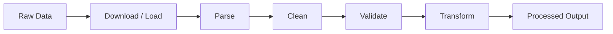

# SolarIQ Data Pipeline

The data pipeline handles offline data ingestion, cleaning, and
transformation. It converts raw OpenStreetMap, weather, and solar
radiation data into formats the backend API can consume.

## Overview



Three independent pipelines share this pattern:

| Pipeline | Input | Output |
|----------|-------|--------|
| City | GeoJSON or OSM JSON | `data/processed/city_buildings.geojson` |
| Weather | CSV or JSON | `data/processed/weather_clean.csv` |
| Solar | CSV or JSON | `data/processed/solar_clean.csv` |

## City Pipeline

### Stages

1. **Load** — Read GeoJSON or OSM Overpass JSON
2. **Parse** — Extract building footprints, resolve OSM node references
3. **Clean** — Remove duplicates, invalid polygons, normalize IDs
4. **Validate** — Check required fields, coordinate ranges
5. **Transform** — Convert WGS84 coordinates to UTM for metric area
6. **Save** — Write standardized JSON with metadata

### Input Formats

**GeoJSON** — Standard GeoJSON with Polygon or MultiPolygon features:
```json
{
  "type": "FeatureCollection",
  "features": [
    {
      "type": "Feature",
      "geometry": {
        "type": "Polygon",
        "coordinates": [[[72.87, 19.07], [72.88, 19.07], ...]]
      },
      "properties": {
        "name": "Building Name",
        "building": "yes",
        "height": "25m"
      }
    }
  ]
}
```

**OSM Overpass JSON** — Raw response from the Overpass API containing
`elements` with `node`, `way`, and `relation` types.

### LOD-1 Geometry Generation

The converter generates LOD-1 box buildings from 2D footprints:

```
Footprint coordinates → Local XY projection → Extrude to height
  → Roof (top polygon)
  → Facades (one per footprint edge)
  → Ground (bottom polygon)
```

Building height is sourced from OSM `height` tag. Default: 15m.

### Running

```python
from data_pipeline.pipeline.city_pipeline import process_city_data

report = process_city_data("sample_data/city/mumbai_sample.geojson")
print(report.status)  # "success"
```

## Weather Pipeline

### Stages

1. **Load** — Read CSV or JSON, normalize column names
2. **Clean** — Parse timestamps, remove duplicates, clip ranges, fill gaps
3. **Validate** — Check coordinate ranges, required fields
4. **Save** — Write cleaned CSV

### Supported Column Names

The pipeline normalizes various column naming conventions:
- `temp`, `temp_c`, `temperature_c` → `temperature`
- `lat`, `lat_deg` → `latitude`
- `rh`, `relative_humidity` → `humidity`
- `wind`, `wind_mps` → `wind_speed`

### Data Sources

| Provider | Type | API Key | Notes |
|----------|------|---------|-------|
| Open-Meteo | Real-time API | No | Free tier, hourly data |
| Local CSV/JSON | File-based | No | Must match expected schema |
| Fallback | Synthetic | No | Clear-sky approximation |

### Running

```python
from data_pipeline.pipeline.weather_pipeline import process_weather_data

report = process_weather_data("sample_data/weather/mumbai_weather.csv")
```

## Solar Pipeline

### Stages

Same pattern as weather: Load → Clean → Validate → Save.

### Data Sources

| Provider | Type | API Key | Notes |
|----------|------|---------|-------|
| PVGIS (EU JRC) | Real API | No | TMY data, global coverage |
| Local CSV/JSON | File-based | No | Must match expected schema |
| Fallback | Synthetic | No | Clear-sky model |

### Output Schema

| Column | Unit | Description |
|--------|------|-------------|
| `timestamp` | ISO-8601 | Observation time |
| `latitude` | degrees | WGS84 latitude |
| `longitude` | degrees | WGS84 longitude |
| `ghi` | W/m² | Global horizontal irradiance |
| `dni` | W/m² | Direct normal irradiance |
| `dhi` | W/m² | Diffuse horizontal irradiance |
| `solar_irradiance` | W/m² | Total solar irradiance |

## Running All Pipelines

```python
from data_pipeline.pipeline.run_all import run_all_pipelines

results = run_all_pipelines()
# Automatically finds sample data in sample_data/
```

Or via script:
```bash
python scripts/run_data_pipeline.py
```

## Validation Limits

| Field | Min | Max | Unit |
|-------|-----|-----|------|
| Latitude | -90.0 | 90.0 | degrees |
| Longitude | -180.0 | 180.0 | degrees |
| Temperature | -60.0 | 60.0 | °C |
| Humidity | 0.0 | 100.0 | % |
| Wind speed | 0.0 | 200.0 | m/s |
| Cloud cover | 0.0 | 100.0 | % |
| Precipitation | 0.0 | 500.0 | mm |
| Irradiance | 0.0 | 1600.0 | W/m² |

## Sample Data

Located in `sample_data/`:
- `city/mumbai_sample.geojson` — Mumbai building footprints
- `weather/` — Sample weather observations
- `solar/` — Sample solar radiation data

These are **synthetic/sample datasets** for development and testing.
They are not real-world observations.
