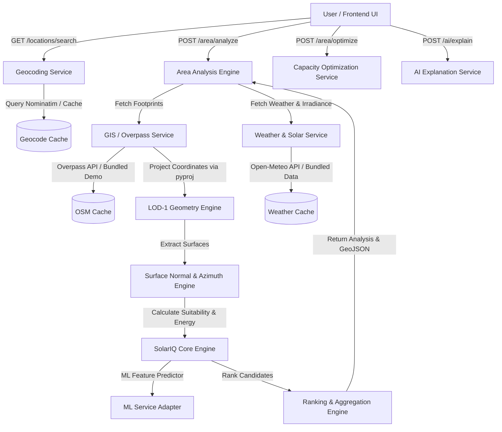

# SolarIQ: Real-World City Analysis Workflow

## 1. Executive Summary & Vision

SolarIQ enables urban planners, solar engineers, municipal authorities, and property owners to perform automated, end-to-end solar and BIPV (Building-Integrated Photovoltaics) potential assessments for real-world cities and neighborhoods without needing manual 3D CAD modeling or custom JSON preparation.

### Core Workflow:
```
1. Search Location (Nominatim Geocoding)
   ↓
2. Define Area of Interest (Radius / BBox)
   ↓
3. Ingest Real Building GIS Data (OpenStreetMap Overpass API)
   ↓
4. Ingest Area Weather & Atmospheric Solar Irradiance (Open-Meteo API)
   ↓
5. Coordinate Transformation (WGS84 Lat/Lon → Local Metric UTM)
   ↓
6. Extrude LOD-1 Geometry (Roof, Facades, Ground with Height Fallback)
   ↓
7. Surface Solar Suitability Scoring & Usable Area Calculation
   ↓
8. Capacity (kW) & Annual Clean Energy (kWh) Estimation
   ↓
9. Multi-factor Surface and Building Ranking
   ↓
10. Capacity/Budget-Constrained Optimization
   ↓
11. Interactive Geospatial Map & 3D Visualization
   ↓
12. Grounded AI Decision & Strategic Explanation Layer
```

---

## 2. Architecture & Subsystems



---

## 3. Data Sources & Provenance

| Subsystem | Primary Live Provider | Fallback / Demo Provider | Legal / Policy Compliance |
|---|---|---|---|
| **Geocoding** | OpenStreetMap Nominatim | Curated local lookup (Mumbai, Bandra, Andheri, Thakur College, etc.) | Custom User-Agent header, 1 req/sec rate limit observance, local cache |
| **Building Footprints & Tags** | OpenStreetMap Overpass API | Curated urban building footprints | Open Database License (ODbL), 25MB safety response cap |
| **Weather Variables** | Open-Meteo Forecast API | Historical regional climate database | Free tier, non-commercial/commercial permissible, cached per area |
| **Solar Irradiance** | Open-Meteo / PVGIS (TMY) | Latitude-dependent clear-sky model (1700-1850 kWh/m²) | Cached per regional area |

### Why OpenStreetMap Instead of Google Maps for Building Data?
Google Maps Terms of Service explicitly prohibit scraping, extracting, or storing building footprint vector geometries or coordinates for external calculation engines. OpenStreetMap provides open, legally accessible building polygon geometries and tagging schema specifically designed for open GIS and engineering research.

---

## 4. Coordinate Reference Systems (CRS)

1. **Input / Map View**: WGS84 Geographic Coordinates (`EPSG:4326`) in decimal degrees (`latitude`, `longitude`).
2. **Physical Calculations**: Projected Universal Transverse Mercator (`UTM`).
   - Zone is automatically determined via `get_utm_crs(latitude, longitude)`.
   - Transformation is performed via `pyproj.Transformer` with `always_xy=True`.
   - All geometric areas ($m^2$), surface normals $(\hat{n})$, azimuths $(\alpha)$, and tilts $(\theta)$ are computed in strict metric Euclidean coordinates, **never in raw latitude/longitude degrees**.

---

## 5. Building Height Fallback Hierarchy

When processing building footprints from OpenStreetMap, building heights are resolved using a 3-tier deterministic fallback:

1. **Direct Height Tag**: `height` tag in meters (e.g. `height=32.5m` $\rightarrow 32.5\text{ m}$, `height_estimated: False`).
2. **Floor Level Multiplier**: `building:levels` tag multiplied by average floor height ($3.5\text{ m}$ per story, e.g. `levels=10` $\rightarrow 35.0\text{ m}$, `height_estimated: True`).
3. **Typology Fallback**: Building type tag mapped to standard urban typology estimates (e.g. `office`: $28\text{ m}$, `apartments`: $24\text{ m}$, `residential`: $12\text{ m}$, `house`: $8\text{ m}$, default: $15\text{ m}$, `height_estimated: True`).

Every building explicitly flags whether its height was directly measured or estimated.

---

## 6. Caching & Offline Resilience

To ensure high performance and prevent unnecessary network calls:
- **Geocode Cache**: Stored in `data/cache/geocoding/` with a 7-day TTL.
- **OSM Overpass Cache**: Stored in `data/cache/osm/` with a 14-day TTL.
- **Weather & Solar Cache**: Stored in `data/cache/weather/` with a 3-day TTL.
- **Area-Level Granularity**: Weather and solar data are requested once per area analysis, never per building.
- **Offline / Zero-Network Mode**: If the internet or external APIs are unavailable, the system automatically falls back to curated sample datasets for key locations (e.g., Bandra West, Andheri East, Mumbai, Thakur College of Engineering). The data provenance is clearly reported as `LIVE OSM` vs `DEMO DATA`.

---

## 7. AI Explanation Layer

The AI Explanation Layer (`POST /ai/explain`) acts as a strategic decision-support advisor. It is strictly anchored to calculated values:
- **Calculated Results**: Hard physics data (building IDs, exact surface areas in $m^2$, installed capacities in $\text{kW}$, annual generation in $\text{kWh/year}$).
- **AI Interpretation**: Architectural feasibility, deployment sequencing (Phase 1: High-yield rooftops $\rightarrow$ Phase 2: Architectural BIPV facades $\rightarrow$ Phase 3: Secondary expansion), and surface avoidance recommendations (e.g., steep north-facing facades and ground surfaces).

---

## 8. API Reference

### Geocoding & Sample Locations
- `GET /locations/search?q={query}&limit={limit}`: Geocodes search query.
- `GET /sample-areas`: Returns list of curated demo locations.

### Area Analysis & Map
- `POST /area/analyze` (or `POST /location/analyze`):
  ```json
  {
    "latitude": 19.0596,
    "longitude": 72.8295,
    "radius_m": 400.0,
    "location_name": "Bandra West, Mumbai",
    "max_buildings": 50
  }
  ```
- `GET /area/{analysis_id}`: Retrieves cached area analysis.
- `GET /area/{analysis_id}/map`: Retrieves GeoJSON feature collection with solar scores and suitability colors for map visualization.

### Capacity Optimization & AI
- `POST /area/optimize`:
  ```json
  {
    "analysis_id": "c1f7b8...",
    "max_capacity_kw": 500.0,
    "min_solar_score": 0.40,
    "allowed_surface_types": ["roof", "facade"]
  }
  ```
- `POST /ai/explain`:
  ```json
  {
    "analysis_id": "c1f7b8...",
    "query": "Where should I install solar panels in this area?"
  }
  ```

---

## 9. Demo Execution Guide

1. **Start Backend**:
   ```bash
   python -m uvicorn backend.main:app --host 127.0.0.1 --port 8000 --reload
   ```
2. **Start Frontend**:
   ```bash
   cd frontend
   npm run dev
   ```
3. **Run Demo Flow**:
   - Open frontend in browser.
   - Click "Start Real-World Analysis" or navigate to "🗺️ GIS City Map".
   - Search for `"Bandra West, Mumbai"` (or select from suggested locations).
   - Select radius `[ 400 m ]` and click `⚡ Analyze Area`.
   - Observe building footprints colored by solar suitability (Green = High, Amber = Medium, Slate = Low).
   - Click any building polygon on the map to inspect its usable area, capacity (kW), and surfaces.
   - Click `✨ Ask SolarIQ AI` and ask `"Where should I install solar panels?"` to receive grounded insights.
   - Click `🎯 Budget / kW Limit` to test the capacity-constrained optimizer (e.g. `500 kW`).
   - Toggle to `🏢 3D Mesh` view to inspect the 3D LOD-1 extruded building models.
